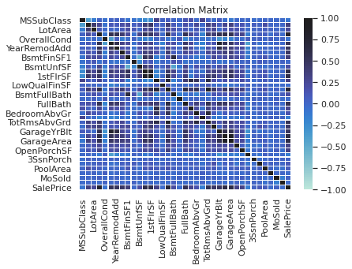

# House-Price-Prediction

## Table of Contents

Process of Machine Learning Predictions
Housing Data Set
1) Understand the problem
2) Generate Hypothesis 
3) Get Data
4) Exploratory Data Analysis (EDA)
5) Data Pre-Processing
6) Feature Engineering 
7) Model Training 
8) Model Evaluation
9) Model Testing

Process of Machine Learning: 

"Keep tormenting the data until it starts revealing its hidden secrets". Well, it can be done, but, there's a way around. Machine learning projects are not about grabbing data and feeding it to a algorithm and make predictions. A good machine learning project involve the below steps.

# 1) Understand the problem: 

One of the most import and critical step in any data related project is to understand the problem we are trying to solve. Understanding the domain plays a very importand role. 

# 2) Generate Hypothesis: 

This is very important step but most often forgotten. Hypothesis generation is an educated “guess” of various factors that could impact the business problem that needs to be solved using machine learning. It hepls in understanding what data to be collected that and from where, key in converting your business problem into a data science problem. This should be done before looking at the data to avoid bias. If done adequately, you would have included all the variables available in the dataset and might include variables that are not present in the dataset.

# 3) Get Data: 

Now that we know what features to get, we looks at various sources to obtain the data. Determine which features are available, which are not. Compare the list of features generated in hypothesis generation to determine which hit the mark, and which ones could be created. This step often helps in creating new features.

# 4) Exploratory Data Analysis (EDA): 

In this step, we dig deep into the data, summarize their main characteristics and visuvalize. EDA is done to understand what the data can tell us beyond the formal modeling or hypothesis testing task. EDA helps you confirm and validatethe hypothesis you make. EDA is considered by some to be more of an art form than a science.

# 5) Data Preprocessing: 

In this step, data cleaning and imputing missing values in done. This step is usually followed along with EDA.

# 6) Feature Engineering: 

In this step, new features are created and added to the dataset. Most of the ideas for creating new features come form hypothesis generation stage. 

# 7) Model Training: 

A suitable alogorith is used to train the model on the dataset.

# 8) Model Evaluation: 

The trained model's performance is evaluated using a suitable error metric. In this step, variable importance is evaluated, i.e,, which variables have proved to be significant in determining the target variable. The best variables are shortlisted and the model is trained and evaluated again. 

# 9) Model Testing: 

Finally the model is tested on unseen dataset.

The above steps are followed in this project to arrive at final prediction.

# 1) Understand the Problem: 

The dataset for this project has been taken from Kaggle's Housing Data  Knowledge Competition https://www.kaggle.com/c/house-prices-advanced-regression-techniques. The aim of this project is to predict the house prices in Ames, Iowa using the 79 explanatory variables which describe (almost) every aspect of residential homes.

# 2) Generate Hyothesis: 

Hypothesis is an idea that is suggested as the possible explanation for something but has not yet been found to be true or correct.

Defining a hypothesis has two parts. Null Hypothesis (Ho) and Alternate Hypothesis(Ha).

Null Hypothesis (Ho): There is no impact of a praticular feature on House Price. 
Alternate Hypothesis(Ha): There exists a direct impact of a particular feature on House Price.

Based on a decision criterion (usually 5% significance level), we either 'reject' or 'fail to reject' the null hypothesis in statistical parlance. Practically, while model building we look for probability (p) values. If p value < 0.05, we reject the null hypothesis. If p > 0.05, we fail to reject the null hypothesis. Some factors which might have direct influence on house prices are the following:

1. Neighborhood comparable - Similar house in the nighborhood
2. Location - The quality of local schools, job opportunities, Proximity to hospitals, shopping, entertainment, and recreational centers etc.,
3. Home size and usable space
4. Age and condition of the house
5. House Upgrades and updates
6. The local market - Is it a seller's market or buyer's market
7. Economic indicators in that particular state
8. Interest rates
9. No. of Bedrooms
10. No. of floors
11. Aminities - Child play area, swimming pool, jaccuzi etc.,
12. Technology - Temperature control, heating system, fire safety, security etc.,
13. Is the house fully furnished, semi furnished or un furnished.
14. Structure and quality of materials used in construction.
15. Area of the land on which house is built
16. Does the house has terrace
17. Infrastructure - Road, rail, airport etc.,
18. Utilities - Electicity, gas, sewage, water etc.,
19. No of bathrooms
20. No of car parks

# 3) Get Data:

The dataset is downloaded into Google colab. The details about the data and variables are given on the Kaggle's competition page.

# 4) Exploratory Data Analysis (EDA): 

Exploring the data is key to draw meaningful insights from the data. 

Missing Data - From the graph below, we can infer that the columns PoolQC, MiscFeature, Alley and Fence have missing values of 99%, 96%, 93% and 80% respectively.

Checking the distribution of the target variable "SalePrice".

The target variable "SalePrice" has a right skewed distribution. A normally distributed target variable helps in better modelling the relationship between dependent and independent variables. Hence we need to apply log transformation so that the target variable becomes normally distributed.

After applying log transformation, the traget varible is normally distributed as show in the graph below.

Checking correlation between numerical variables

